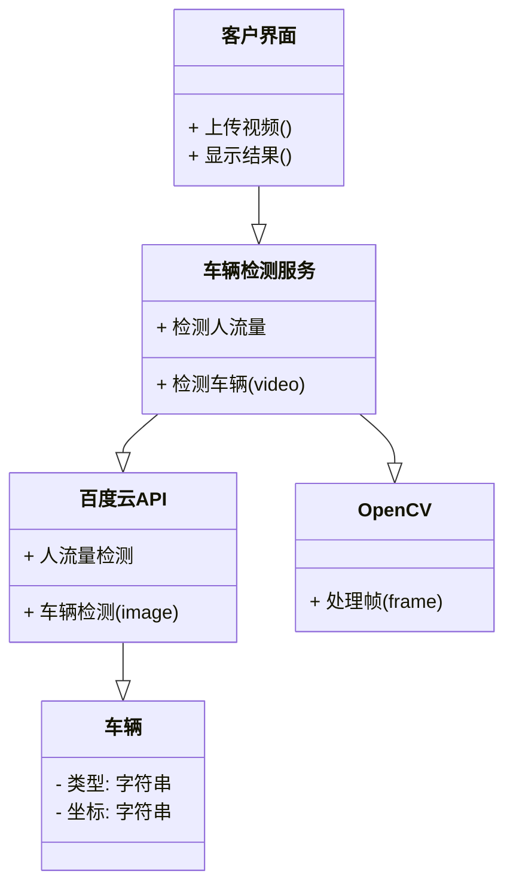
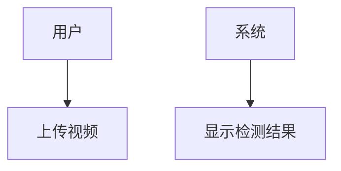
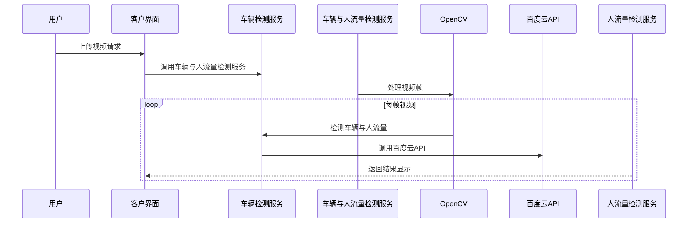

2024暑期实训课

### 7.1下午

学生管理系统（面向对象）

### 7.2上午

通用物体和场景识别

图像主体识别

车辆属性识别

通用文字识别

网络文字识别

识别

身份证识别

车辆识别

### 7.2下午

#### opencv

opencv依赖于numpy 类型为ndarry

### 7.3上午

1 安装pyqt5

```
pip install pyqt5
pip install pyqt5-tools
```

### 7.3下午

img

video

### project1

### 1. 项目介绍

#### 背景

车辆检测和识别系统旨在利用计算机视觉和人工智能技术，对视频或图像中的车辆进行实时检测和详细识别。这种系统可以在城市交通管理、安全监控和智能交通等领域发挥重要作用。

#### 功能介绍

- **车辆检测功能**：通过 OpenCV 处理视频帧，检测图像中所有车辆的位置和类型。
- **车辆属性识别功能**：利用百度云的车型识别和车牌识别接口，识别车辆的具体型号。

#### 使用场景

- **智能交通监控**：在城市交通路口或高速公路上，实时监测车流量和车辆类型，帮助交通管理部门优化路况。
- **安全监控**：监控停车场或重要建筑入口，识别和记录进出的车辆信息。
- **交通数据分析**：收集和分析车辆数据，为城市规划和交通政策制定提供数据支持。

### 2. 功能结构图及功能细节描述

#### 类图




#### 用例图



#### 序列图




- **上传图片/视频功能**
  - 允许用户通过界面上传要进行车辆检测的图片或视频。
- **车辆检测功能**
  - 使用 OpenCV 处理帧，检测图像中所有车辆的位置和数量。
- **车辆属性识别功能**
  - 调用百度云的车型识别接口，识别车辆的具体型号和特征。
  - 调用百度云的车牌识别接口，识别车辆的车牌号码和位置。

### 4. 技术结构

- **前端界面**：使用 PyQt 框架进行界面设计和用户交互。
- **图像处理**：利用 OpenCV 库对图像或视频帧进行处理和分析。
- **百度云接口**：调用百度云的车辆检测、车型识别、车牌识别接口。
- **数据处理与分析**：处理识别结果，提取并展示相关的车辆信息。


### 5. 总结

该系统在智能交通、安全监控和数据分析等领域具有广泛应用前景。下一步可以进一步优化界面设计，提升用户体验，同时考虑系统的可扩展性和性能优化，以应对不同场景和需求的挑战。
